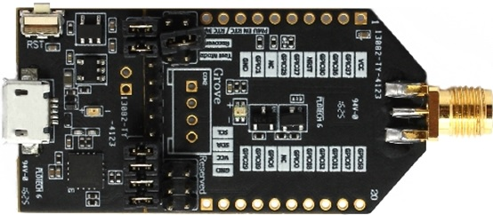
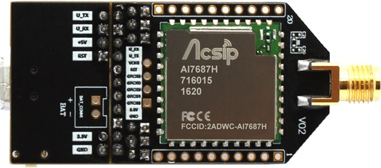
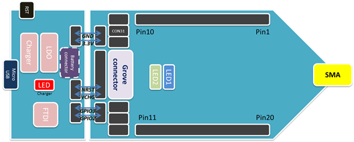
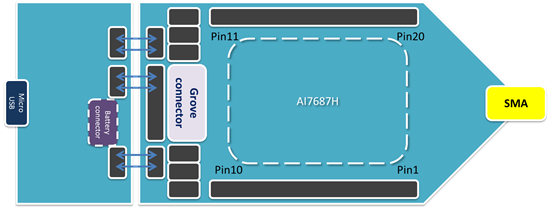

<H1> EK-AI7697H (AI7697H XBee) User Manual </H1>

<H2> Description</H2>
 
EK-AI7697H, aka AI7697H XBee,  is a low-cost and easy to use Internet of Things (IoT) development platform for RTOS to design, prototype, evaluate and implement IoT projects. It is based on AI7688H stamp Module, with ARM Cortex-M4 with floating point MCU in package. The HDK enables rich connectivity features, communication with cloud services and real-time control.
 

<H2> Hardware Features</H2>
 
- Main Chip: MT7697N
- ARM Cortex M4 MCU with FPU with up to 192MHz clock speed
- Embedded 352KB SRAM and 64KB boot ROM
- Support 2.4G Wi-Fi IEEE 802.11 b/g/n
- Hardware crypto engines including AES, DES/3DES/ SHA2 for network security
- Internal switch and control for Rx diversity
- Bluetooth Low Energy
- Small Size 18mm X 18mm X 1.6mm
- Versatile interface:
 - 28 GPIO/PWM multiplexed with other interfaces
 - Two UART interfaces with hardware flow control and one UART for debug, all multiplexed with GPIO
 - One SPI master/slave interface multiplexed with GPIO
 - One I2S interface multiplexed with GPIO
 - Two I2C master interface multiplexed with GPIO
 - 4 channel 12-bit ADC multiplexed with GPIO
 - IrDA
 
 

<H2> Hardware Description</H2>
AI7687H XBee includes a main board and a AI7697H stamp module. The AI7697H stamp module is mounted on the main board.
 

<H3> Top View</H3>

 
<H3> Buttom View</H3>

 

<H3> Pin Define (Top View)</H3>

 
<H3> Pin Define (Buttom View)</H3>

 
 

<H2> Hardware Configuration</H2>
- Setting jumpers on location [3.3V] and [GND] for supply power from USB
- Setting jumpers on location [GPIO2] and [GPIO3] for UART debug port
- Setting jumper on location [NRST] for RST key function
- BAT connector only supported 3.7V 200-1000mAh Li-ion battery
- Use Micro USB cable Connect from PC to EK-AI7697H  
- Open serial console application, ex Putty or TeraTerm, with 57600 bps(8N1)  
- Configuring Normal / Recovery mode
 

<H2> Recovery Mode</H2>
<B>1. </B> Setting jumper on on location [CON31] 
<B>2. </B> Press RST key to trigger a hardware reset. Debug console shows “ccc” always. 
 

Recovery mode is used for two purpose:
- RF performance test (with Mediatek QA tool)
- Update firmware (with MT76x7_Flash_Tool)
 

<H2> Normal Mode</H2>
<B>1. </B> Remove jumper on on location [CON31] 
<B>2. </B> Press RST key to trigger a hardware reset. 
 
